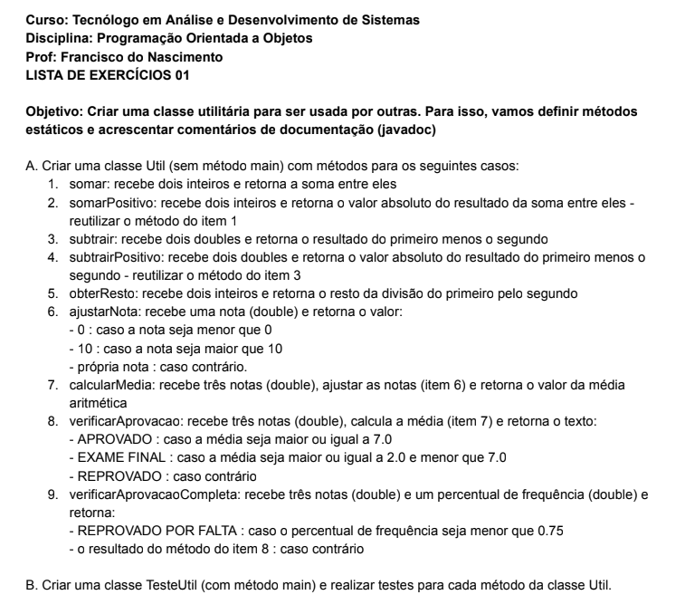

# Lista de exercícios 01 (Criando a classe Util)

Esta lista contém uma classe utilitária chamada `Util` com métodos para operações aritméticas, ajuste de notas e verificação de aprovação. A classe também inclui uma classe de teste, `TesteUtil`, para validar a funcionalidade dos métodos.
# Foto da lista de exercícios 01:


## Funcionalidades da Classe Util

- **Operações Aritméticas**
  - `somar(int a, int b)`: Retorna a soma de dois inteiros.
  - `subtrair(double a, double b)`: Retorna a subtração de dois doubles.
  - `obterResto(int a, int b)`: Retorna o resto da divisão entre dois inteiros.

- **Ajuste de Notas**
  - `ajustarNota(double nota)`: Ajusta a nota para um valor entre 0 e 10.

- **Cálculo de Média**
  - `calcularMedia(double a, double b, double c)`: Calcula a média de três notas ajustadas.

- **Verificação de Aprovação**
  - `verificarAprovacao(double a, double b, double c)`: Retorna o status de aprovação com base nas notas.
  - `verificarAprovacaoCompleta(double a, double b, double c, double frequencia)`: Verifica a aprovação considerando a frequência.

## Execução dos Testes

Para executar os testes, compile e execute a classe `TesteUtil`:

```bash
javac lista01/*.java
java lista01.TesteUtil


